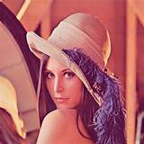

This program takes a "real" image, which could be
colorful, or grayscale, and turns it into a
cartoon-like image, which has much less colors
compared to the original one.

# Demo

Original image:



Cartoonized image:


# Get Started

```Bash
$ git clone https://github.com/LIU-Xnd/cartoonize.git

$ cd cartoonize/

$ pip install -r requirements.txt

$ python ./src/cartoonize.py ./img/lena.jpeg -n 2 -o ./img/lena.cartoon.jpeg
```

See help:

```Bash
$ python ./src/cartoonize.py -h
```